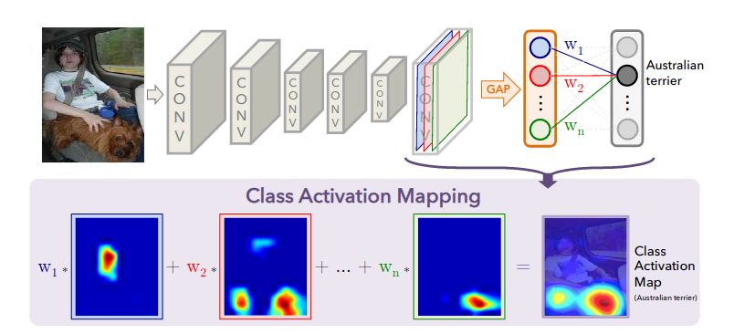
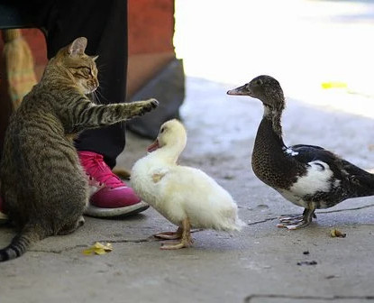

# Class Activation Maps in PyTorch

Implementation of Class Activation Maps as described in the paper titled ["Learning Deep Features for Discriminative Localization"](http://cnnlocalization.csail.mit.edu/Zhou_Learning_Deep_Features_CVPR_2016_paper.pdf)

| Input  |  CAM (cat)  | CAM (goose) |
|---|---|---|
|   | .gif)  | .gif)  |

## Supported Torchvision models
At the time of writing CAM for only the following models from Torchvision could be generated using the code:

- resnet18
- resnet34
- resnet50
- resnet101
- resnet152

## Usage

`python class_activation_map.py --model_name resnet18 --input_image data/car.jpg`
generates an output CAM overlayed image in results/ directory.

To additionally save a gif animation:

`python class_activation_map.py --model_name resnet18 --input_image data/car.jpg --save_gif`

## Examples 

|  |   |   | 

